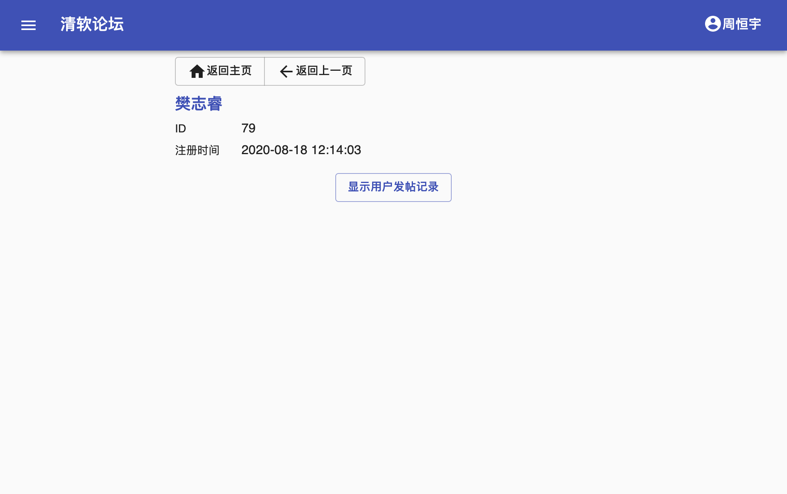

# 清软论坛前端
2018013367 周恒宇
## 实验说明
使用了 React 框架，通过 create-react-app 建立项目。使用 Typescript 编写。

展示页面：/post/574

### 主要的第三方库说明
* [`Material UI`](https://material-ui.com) - Material Design 风格的 UI 库
* [`React Markdown`](https://github.com/rexxars/react-markdown) - React 下的 Markdown 渲染器
* [`React Markdown Editor Lite`](https://github.com/HarryChen0506/react-markdown-editor-lite) - React 下的 Markdown 编辑器
* [`Redux`](https://redux.js.org/),
  [`React-Redux`](https://redux-toolkit.js.org/) - Redux 和 React-Redux 工具
* [`moment`](https://momentjs.com/) - 时间与格式化库
* [`React Syntax Highlighter`](https://github.com/react-syntax-highlighter/react-syntax-highlighter) - 代码高亮
  
## 启动/编译方式说明
先运行 `npm init` 初始化
### 启动(调试)
`npm start`

监听在 3001 端口

### 编译
`npm build`

可以配合 nginx 进行代理
```
server {
    listen 80;
    listen [::]:80;

    server_name thss-bbs.xample.com;

    root /var/www/thss-bbs;

    location / {
        try_files $uri $uri/ /index.html;
        index index.html index.htm;
    }

    location ~ ^/api/ {
        proxy_pass http://simplebbs.iterator-traits.com:80;
    }
}
```

## 功能实现情况
### 基础要求
* [x] 使用 create-react-app 创建了前端项目，通过 Fetch API 与后端交互;

* [x] 用户可以进行登录登出，在关闭浏览器后仍能保留登录状态;

* [x] 用户可以浏览帖子列表，并且可以主动发帖/回帖或编辑自己发布的帖子与回帖; 用户可以查看帖子详情以及相应的回帖，可以查看指定用户的发帖记录; 

* [x] 使用 Markdown 实现富文本，并定义了拓展的富文本标签;

* [x] 可以正确显示不同用户的发帖记录，并实现合理的跳转;

* [x] ⻚面符合现代主流网⻚审美。(大概)

### 进阶要求
* [x] 实现bbs中楼中楼的显示来区分回复主楼与回复某一楼层，并实现回帖列表的前端分⻚;

* [x] 自定义标签来实现表情与代码段的插入;

* [x] 实现外部图片链接的插入与合理展示(如⻓图);

* [x] 实现“只看楼主”、“收藏”、“浏览记录”功能;

* [x] 额外的实现了可折叠文本(spoiler)功能

## 亮点和难点
### 亮点
* 对于移动端有着较好的支持，在小屏幕上也不会出现元素错位、无法阅读等情况

* 可折叠文本(spoiler)。这是在论坛上经常作为标配出现的功能。
通过 #(spoiler)文本(/spoiler)的方式创建

* 表情标签。使用 #(sticker:namespace.name) 的方式插入，如 #(sticker:tieba.滑稽)，保留了对未来的扩展性

* 代码段。使用了原生的 Markdown 语法，并采用 Syntax Highlighter 进行自定义的高亮。

* 楼中楼。选用了层层嵌套的方式。第三层即以及更高嵌套层级会直接展开，避免挤占过多屏幕空间。

### 难点
* 楼中楼的实现

为了实现一个外观尚可的楼中楼，在样式调整上花费的大量的时间。分页机制也比较复杂。

* 自定义标签

自定义标签需要在编辑器上添加UI，并添加额外的语法解析步骤。

* 异常处理

前端会遇到各种不同种类的错误，将其正确的捕获并展示有一定的挑战性。


## 展示
未登录/登录过期时，会来到这个页面。


点击中间的登录按钮进入登录界面。


登录出错时，下方会给出提示。
登录后进入帖子列表页面。

### 主页 (帖子列表)


主页中间部分为帖子列表，右上方有刷新和发帖按钮，三个点按钮可以展开更多选项。


这里可以选择帖子的排序方式，点击右侧确定以生效。

还可以根据用户ID筛选发帖，点击确定以跳转。


帖子列表下帖子显示较为紧凑，左边为标题和正文摘要，右边为发帖者、最近回帖者和回帖时间。
点击后进入帖子详情。

点击 App Bar 左端的菜单按钮可以展开导航抽屉。这个 App Bar 在任何页面都可见。抽屉中提供了便捷的导航链接。


### 帖子详情
示例: /post/687


帖子中可以层层嵌套，但从第三层回复开始都会被展开到第三层，如图所示，这是为了避免层数过多造成阅读不便。

点击左边的竖线可以展开/折叠层次。

每层回复右侧的 #1234 是回复的 Reply ID。


主贴上有只看楼主选项，选择后只显示主贴和楼主的回复。

自己的回复可以进行编辑。


回复太多时，会自动折叠，可以点击"更多回复"进一步展开，或"收起回复"折叠起该楼层所有回复。

### 编辑，发帖


自己发的帖子可以编辑。点击"编辑"按钮后会来到该页面，内容为原本的帖子内容，可以修改标题和正文，点击提交以应用更改。


自己的回复也可以编辑，但标题栏会被固定为"回复：主贴名"。

发帖和进行回复的 UI 是一致的，这里不再赘述。


工具栏上最右端两个分别是表情和可折叠段(spoiler)，用于便捷插入自定义的标签。

其他均为原生 Markdown 功能。

### 用户页面
通过右上角名字或者左边菜单的"个人中心"进入自己的用户界面。


在自己的用户界面里可以查看发帖记录、历史、收藏，以及登出。左侧 Drawer 里也有前三个按钮的链接。

在帖子浏览时点击用户的头像也可以进入其他用户的信息界面，并查看其发帖记录。



### 收藏和历史
浏览的帖子会自动的加入历史记录。

在帖子详情页面右上方的收藏按钮，点击后可以收藏该帖子。


浏览历史提供了一键清空功能。


在收藏页面可以查看自己的收藏。下面的帖子列表都是超链接。


因为没有批量访问给定 postId 帖子的 API，历史和收藏展现的是在访问/点击收藏时帖子当时的快照，可能与最新页面不符。

### 异常

页面不存在


用户不存在


各个页面均有异常处理。

## 模块具体说明
### src/
* `index.tsx` - 主页。包括了 Router, Drawer 和 Top App Bar
* `backend.tsx` - 包装了后端调用，提供为 async 方法
* `store.tsx` - Redux Store
* `strings.tsx`, `constants.tsx` - 字符串常量，数值常量
* `urls.tsx` - 链接和链接格式化
* `about/about.tsx` - 关于页
* `page_not_found/page_not_found.tsx` - 404 页
### src/mainpage
* `drawer.tsx` - 侧边 Drawer
* `homepage.tsx` - 主页，未登录时是提示登录页面，登录后是帖子列表页面
* `post_list_page.tsx` - 帖子列表实现页面
### src/post
* `post_detail_page.tsx` - 帖子详情页面
* `post_editor.tsx` - 帖子编辑器
* `post_edit_pages.tsx` - 发帖，回复，编辑帖子，编辑回复页面
* `post_list_view.tsx` - 帖子预览列表组件，用于帖子列表页面
### src/user
* `favorites_page.tsx` - 收藏展示页
* `history_page.tsx` - 历史展示页
* `login_page.tsx` - 登录页
* `user_page.tsx` - 用户信息页
* `user_bar_view.tsx` - Top App Bar 右侧的用户信息展示
### src/utils
* `shared_components.tsx` - 公用的组件，页面上方的"返回主页"和"返回上一页"按钮
* `time_view.tsx` - 时间展示组件和公用函数
* `utils.ts` - 公用方法
  * HTML 展平
  * 历史记录相关方法
  * 收藏相关方法
### src/rich_text
* `code_view.tsx` - 代码块呈现
* `image_view.tsx` - 图片呈现
* `markdown_view.tsx` - 对 React Markdown 的再封装，添加了用于解析自定义标签的插件和渲染代码块和图片的 renderer
* spoiler - 可折叠文本
  * `spoiler_plugin.tsx` - React Markdown Editor Lite 的工具条按钮插件
  * `spoiler_syntax.tsx` - React Markdown 的语法解析和呈现插件
* sticker - 表情
  * `sticker_plugin.tsx` - React Markdown Editor Lite 的工具条按钮插件
  * `sticker_plugin.tsx` - React Markdown 的语法解析和呈现插件
* `underline_syntax.tsx` - \+\+下划线语法\+\+ 的语法解析插件
